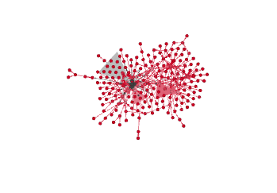
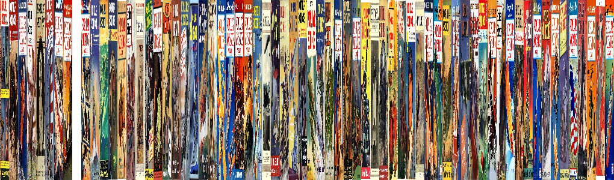
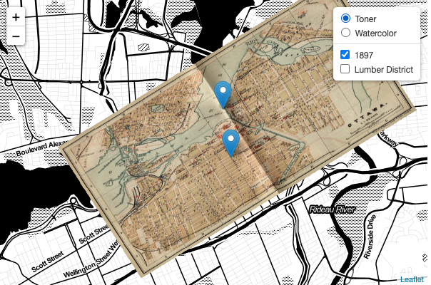

# Paula's HIST3814 Site
## Welcome

This is my new static site where all of my dighist journals and notes have been compiled :)

It reads [markdown](https://www.markdownguide.org/) and turns it into html.

## Week One

- [Journal](https://github.com/paula-rodrigo/week-one/blob/master/journal.md)
- [Notes](https://github.com/paula-rodrigo/week-one/blob/master/notes.md)

## Week Two

- [Journal](https://github.com/paula-rodrigo/week-two/blob/master/journal.md)
- [Notes](https://github.com/paula-rodrigo/week-two/blob/master/notes.md)

## Week Three

- [Journal](https://github.com/paula-rodrigo/week-three/blob/master/journal.md)
- [Notes](https://github.com/paula-rodrigo/week-three/blob/master/notes.md)

## Week Four

- [Journal](https://github.com/paula-rodrigo/week-four/blob/master/journal.md)
- [Notes](https://github.com/paula-rodrigo/week-four/blob/master/notes.md)

## Week Five

- [Journal](https://github.com/paula-rodrigo/week-five/blob/master/journal.md)
- [Notes](https://github.com/paula-rodrigo/week-five/blob/master/notes.md)
